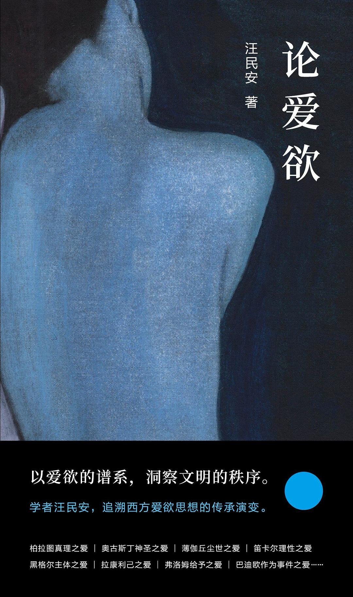

南京大学出版社｜2022年7月

### 相遇记
最早和这本书邂逅，大约是 22 年底在苏州的诚品书店。当时它摆在新书架上，小巧的开本和深色的封面不算显眼、但也不至于从我的目光逃逸。书名包含的关键词**爱欲**，与亲密关系、爱情比起来，似乎更带一些思辨的意味，但又不能不牵涉性、身体和欲望。作者汪民安虽然不是老朋友，但也曾在书店翻过他的标题奇异的另一本书《论家用电器》；查查其人，发现是[清华大学中文系](https://www.zhongwen.tsinghua.edu.cn/info/1171/1390.htm)的教师，而作品却几乎都是关于哲学，尤其尼采、福柯、德勒兹等当代哲学的，令我有些好奇。

年底从图书馆借回这本书，在新冠高峰来临前读完了书的大部分内容，年后觉得很有收获，开始整理自己的所得，但也一直拖沓到现在，才想着整理出来。

### 关于“爱欲”一词
我在写笔记的时候，把这本书的英文翻作 eroticism - 维基百科解释为
> A quality that causes sexual feelings, as well as a philosophical contemplation concerning the aesthetics of sexual desire, sensuality, and romantic love.

我觉得这个描述是能与中文原词参照解释的。

### 所感
只谈阅读体验，这本书让我联想起 [De Botton](https://zh.wikipedia.org/wiki/%E8%89%BE%E5%80%AB%C2%B7%E7%8B%84%E6%B3%A2%E9%A0%93)。后者的书以哲学视角切入大家关心的话题，援引 经典，但呈现起来却通俗流畅，因而作品颇畅销，甚至近年还有 Youtube Channel: School Of Life。而这本书也是类似：谈哲学，但写作却读起来像散文。作者看起来也无益将其作为哲学著作发布，因为书中更多的是观念的梳理和对话，换言之，是一部关于爱欲的观念史。

也正因此，这本书和近来读的严谨、晦涩的康德哲学传统很不一样。

### 所思
关于爱和欲望，从流行文化里我们见到的东西太多。而这里，作者带给我们一些更具历史视野的视角。书里的不同章节，顾及到爱的不同侧面。尤其是近现代，对主体、事件这些概念做了重新阐释后，释放了爱里面的突破性的、人性的力量。

书里提到的人、事洋洋洒洒（批评者或可指为掉书袋），即使是按图索骥，以这些为起点探索，都让我觉得很有意思。

这本书已经是对观念的浓缩（作者的评判相对克制，但也并非不能察觉），因此，我并不准备对全书做精炼的概括，而更想记录一些我阅读瞬间有启发和共鸣的观点。下面几条是我 highlight 的若干观念，它们的前后背景可以在后附的笔记里读到：
- 薄伽丘和斯宾诺莎，强调爱的不断变化，而爱的关系繁复、多样，各自独特
- 拉康的爱是自爱论，刚接触时让我惶惶然
- 弗洛姆《爱的艺术》里的观念，再次相遇：两个人变成一个人而仍是两个人
- 巴迪欧说，爱是断裂的事件，好像从思辨意义上刻画了被爱击中时的惊喜与震动
- 爱情存在通俗的语法模式，而真正的爱应当反抗与打破有形无形的规范

## 笔记：按章节划分
### Chapter 1 .. 3
探索书中提到的名字和概念、观点
-   真理之爱：柏拉图与前苏格拉底哲学家
    -   爱是好的，因为爱和死相对，爱是创造
    -   男女肉体的爱创造生命，带来种族延续；而希腊式的同性之爱能启迪年少的男孩，通过知识和教导，带来灵魂的不朽
    -   爱欲是一个不断上升的阶梯，身体的爱是最容易接近和入门的，但最高层次的爱欲在于追求真理-知识。借由身体和灵魂之爱，我们可能抵达真理之爱的更高境界。
    -   后世的回响：叔本华
-   神圣之爱：奥古斯丁及同代人
-   尘世之爱：意大利文坛三杰 Three Crowns of Italian Literature 彼德拉克-但丁-薄伽丘 （书中展开顺序）
	-   但丁因为贝娅特丽齐的引导而能引向上帝之爱。尘世之爱不再是应弃绝的、可鄙的，而可以成为一个通向上帝之爱的阶梯
	-   彼德拉克和薄伽丘尤其如此：
	-   没有什么永生，爱不是为了追求永生；而是因为生命有限，死亡可怕，反而要通过爱来对抗死亡；甚至，爱可以作为人性的彰显和人的意义。
	-   薄伽丘 Boccaccio 把肉体之爱置于最高处。爱欲中的性，从从属的、可有可无的地位上被擢升为一个本能的力量和动力。性爱出现在历史的地平线上。
- 衍生 - 萨德、乔治·巴塔耶，性的快感与死的苦痛，有张力的结合

### Chapter 4 爱的几何学和地理学：以斯宾诺莎和德勒兹为中心
- 在十七世纪，特别是笛卡尔那里，爱被理性主义地分析和解释；爱不再和不朽或死亡这些重要命题之间关联，而是被视为情感、激情的一个部分，可以被理性理解其规律，辨明其分类。爱不再是充满偶然性、独一无二的特殊经验。
- 笛卡尔用一种动力学的解释框架去分析爱。爱恋是一种力，根据爱恋者对于对象的爱和对于自己的爱做大小比较，他将爱分为喜爱-友爱-虔诚之爱。最后一种爱一个对象甚至超过自己的爱，他认为“基本的对象毫无疑问是那至上的上帝”。
- 但在斯宾诺莎那里（主要是《伦理学》），爱和情感被置于一种几何学的框架
	-   快乐使身体的力量增加，痛苦使身体的力量减弱、受人控制，而欲望则是情感所驱动的行为、是一种努力
	-   爱的本质是快乐，是主动而积极的力之变化
-   对斯宾诺莎-德勒兹而言，人不是稳定的静态的存在者，爱也不再追求永恒和不变作为本质。人的情感、冲动、欲望和爱都随着人的状态变化而变化，也被外界原因的力量改变。
	-   勾连到存在主义那里：海德格尔说，人应该从存在而非存在者的角度去断定。我理解说，人不是一个抽象的概念体系中的对象，不存在一个预设的本质，而是一个积极的能动者。不应该讨论人（身体）是什么，而是讨论人要做什么和能做什么。
-   因此，爱是“一种变化着的快乐情感，一种双方关系所导致的奇怪的幸福”。没有生理规律，没有固定定义，没有标准的爱、典范的爱。它是双方关系的变化性，会适应任何轻微的撬动，向变化性开放。同时，每一种关系也有其独一性，有关系中个体特定的速度与强度；甚至，每个个体不单单只是一个独立的个体，而是带着已有的家庭、社会关系。爱不仅是个体和个体的结合，甚至是共同体和共同体的结合。

评：
相对于正襟危坐的谈论爱，薄伽丘引入肉体和性，以及斯宾诺莎-德勒兹强调独特性和流动性，都更容易让我感到情切和共鸣。

从自己的体验上说，爱首先是亲密的、私人的，自己不愿意把它视作一个需要被教导、需要被评判好坏的关系；
其次，自己更愿意相信所处的关系是开创性的、独一无二的，而不是预先被定义的，更不是某个教条或者某个普世模版的简单套用；
而存在主义那种强调可能性与能动性（我的粗浅理解）也尤其会给我一种 empowered 的感受。

### Chapter 5 承认
这一章的思想者们关注爱欲中的主体

黑格尔：主体在爱中彼此承认，而这打破了人与人间为了得到对方承认永无休止的斗争的循环。爱是最强烈，也最彻底的承认。
- 联系到黑格尔的历史观：人与人通过爱获得承认，是历史的理想状态，也是历史最终的终结
- 达到爱需要消除差异，尤其需要自我否定，才能合二为一。“我否定掉我后，我才可能全部渗透和融入另一个人的意识里”。

拉康：爱是为了自爱。我爱你是为了听到你说爱我的回应。
- 爱是要爱对方的匮乏，从而可以作为主体拯救对方，甚至控制对方
- 因此可以解释失恋：失恋是自恋遇挫的痛苦

列维纳斯：引入抚爱这一概念，爱是反复而耐心地轻触和探索，是对于对方的至高尊重，是把自己交给对方，让对方居于主导

> 爱是想触碰又收回手 

\- J.D. Salinger, *The Heart of a Broken Story*

叔本华：爱包括自爱的部分与博爱的部分，爱的核心是在承受痛苦的世界里对人以同情，从而给予人世以慰藉

### Chapter 6 事件
弗洛姆《爱的艺术》：用爱达到人与人间的结合。这种爱是积极的、给予性的力量，使得双方能互相激发，持续成长和成熟。爱是克服人类先天所处的孤独状态的方法。
- 爱不回牺牲个体的特性与完整性，而会促使个性继续滋长。“两个人变成一个人而仍是两个人”。

阿里斯托芬：提供了一个著名的关于爱的描述。人最开始都是圆形的，有三种类型，男男、女女和男女合体，他们都有四只手、四只脚、两套器官；但由于触怒了宙斯，它们被强行劈开，因此要在人世努力寻找残缺的另一半，于是就有了异性恋和同性恋。
- 结合是为了达到本属于一体的完整性
- 暗示：没有爱的人是残缺与不完整的
- 与后世卢梭、本雅明的观念也都有共鸣，认为人类的开端阶段是最纯真，也最完善的

巴迪欧：爱是事件，是一分为二。
- 事件强调爆破性的决断甚至决裂。在此之前，混杂的经验都被纳入一个统一体，而时间让人无法回避地、无法逆转地意识到，这个统一体已然断裂为二了。
- 面对事件的主体需要能肯定事件带来的断裂，忠实地面对事件，并将其制作为真理。
- 爱这一事件让人从稳定、规律的轨道中脱离出来，与过去的自己、过去的生活告别，而带入一个新的眼光，以对方和（“二”人）的经验、视角来理解和体验。
- 简单说，爱带来突破性的新体验。

另一个重要话题是爱和真理的纠缠关系
- 从德勒兹、海德格尔那里，爱能激发思想和写作的创造性，爱刺激思想后，能和思想想伴生
- 阿伦特、尼采、福柯和罗兰巴特则认为，思想和写作就是为了赢得爱，甚至没有爱，思想是不可能的
- 而且这里涉及的爱欲，不是抽象的，而是特定的、具体的、独一无二的爱，这样的爱才格外激发思想的生机与活力

### Chapter 7 奇遇
奇遇（adventure）是打破阻碍的冒险之遇。

两个经典的爱的奇遇故事：罗密欧与朱丽叶、梁山伯与祝英台
- 家庭仇敌或者父母之命成为爱的阻拦 - 反映着社会系统的不匹配让爱走向悲剧性的抗争
- 对于不可能性的抗争最终引向为爱而死

与奇遇对立的，是某种规范之爱。这里的规范可能是
- a. 有形的社会、文化规范。尤其是婚姻制度作为法的结合，提供生育的保障和财富地位的巩固
- b. 爱情的语法模式（尼克拉斯·卢曼）。对爱情和婚姻的固定行为模式，一代代承袭，成为一种先验的爱情模式；人们遵照这种模版学习爱情。“有那么一些人，如果他们没听过别人谈论爱情的话，是绝不会成为恋爱者的。”

这些规范，不仅是一般意义上婚姻自由、女性解放运动所必然解决的，有了自由恋爱，人们依然可能被有形和无形的规范束缚，自由成为市场化的算计。
而奇遇之爱，鼓励我们打破任何的规范，去做创造者，做颠覆者。

盖拉西姆·卢卡的诗集中文译名为我们做了概括，要做《爱情发明家》
> 参与这可爱的星云 
> 同时进行的 
> 分解 
> 与结晶 
> 冷却与燃烧 
> 这就是我挚爱的恋人 
> 永远在生成 
> 一直被发明

发明恋人，意味着爱可以打破压抑和禁忌，创造自己的精彩。

书里举了诸多影视的例子：李安《色·戒》里对政敌之爱，贾樟柯《山河故人》里爱上与少年的母亲年龄相仿之人，爱上野兽，爱上猿猴，爱上机器人...
