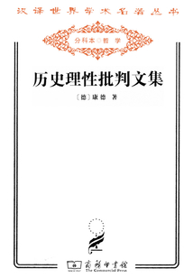

商务印书馆｜1990年

何兆武译

### 康德的书，哪有好读的？
康德的书，据说同代人（甚至他自己）都觉得难读，跨越了两百多年，再加上历史和文化语境的差异，今天再读自然有额外的难度。我借这本书时，虽然看到其正文不过 200 页，但也想到了自己可能要花很多精力和决心才读下去。

事实证明确实如此，这本书也是 22 年 12 月开始翻读的，直到 23 年 1 月底那段时间过年在家，自己才找到一些适合阅读的心境和契机。

这书和《道德形而上学奠基》（简称《奠基》）又不同，算是康德的一篇论文集。里面好些文章都是发表在《柏林月刊》上，更有好几篇都有与人讨论、对话的性质。而我自己的感觉是，每篇文章都不“水”，都蕴藏着雄辩的观念，也提供了有条理的论证，虽然会觉得每个句子读起来都费力气，但也几乎会觉得读完一篇下来，所见识和所收获的，仍是与付出的努力匹配的。

### 散记
#### 第二篇《答复这个问题：“什么是启蒙运动？”》
可以看作是介绍启蒙的简明读物。

康德开宗明义的就指出启蒙的定义 - 启蒙运动就是人类脱离自己所加之于自己的不成熟状态。这里的关键点在于，这种不成熟状态并不是因为外界的限制，而是他们（作者所说的“绝大部分人”，也带有明显歧视的特别指出，“包括全部的女性”）都认为步入成熟是艰辛而危险的，因而自愿地让其他人作为保护者监护着他们。

而这些被保护者，似乎习惯甚至于爱好这种不成熟。因为不成熟是安逸的，无需自己费力思考、权衡，只需把一切委派于外在的监护者，牧师、教官、医生、税收官... 

但这毕竟是一种莫大的牺牲。因为以康德的观点，人被自然赋予的最核心的秉赋就在于其理性。人有义务运用其理性，通过自己的奋斗走出不成熟的状态。而这些自愿放弃运用理性的人，如果能认识到理性的价值，能意识到运用理性并非禁忌，而且也没有保护者们教导的那么危险，则他们是能得到启蒙的。

启蒙是一个进程，它并不可能猝然而至。在这个进程中，存在促进的因素，也存在限制的因素。而康德说，启蒙唯一依赖的是自由，而且是在一切事务中“公开运用自己理性的自由”。

所谓公开运用，文本中是把它和私下运用相对立的 —— 因为有些场合的自由是无关紧要的、甚至有可能损害共同体的利益。比如服役的军官接受任务，或者牧师接受委托进行宣教，他们并没有自由去争辩上级的命令，或是随心所欲地讲解，因为他作为某一团体和职业的成员，需要履行职务中的必要义务，让这个机器运转。

但于此同时，他作为整个共同体的成员，作为“世界公民”，则有充分自由甚至责任，把自己的理性思考传达给世界，而无需负担任何良心上的不安。因为这样公开的运用自己的理性，是人类的神圣权利，而这些理性思想的传播与对话，才能促进人类在启蒙中不断进步。

这样的公开运用理性，在脚注中被一个更明白的、也更熟悉的现代词汇代替了，即“言论自由”。承袭前面的理论论述，这篇文章后面的若干部分，都在不遗余力地呼吁君主，给予民众更充分的言论自由，而反对精神性的专制主义。他在结尾还宣称，当人民慢慢掌握这种自由，而政权按照人的尊严去看待人时，政权本身也会受益。

#### 第七篇《重提这个问题：人类是在不断朝着改善前进吗？》
谈的是人类历史的走向和判断。

作者其实也说，人类的自由是无法预知的，理性可以对应然加以命令，但无法预言人类将要做什么。但作者依然通过已有的经验的观察，对人类未来历史的倾向加以判断。

关心和了解法国大革命的人们，表现出对革命的普遍热忱与同情，而这些人本身与法国和法国人到利益并无切身关联。这一证据让康德相信：人类整体道德倾向上是向善的，是朝着理想的东西（权利观念、共和体制）前进的。即使大革命失败，它也揭示了人类改善的内在秉赋。同时，大革命也唤起人们的启蒙。

但要达到改善，需要消除一些阻碍，尤其是战争。需要自上而下的进程为走出战争提供基础（详细的规划参考第六篇《永久和平论》）。而这些甚至都只是消极的智慧，人类究竟能否朝着改善前进，还取决于环境等偶然性因素。

### 从今人的视角读，也有便利
虽然我一开始就宣称，康德的书，没有好读的。
但读他的一些观念，尤其是这本书涉及的历史的、政治哲学的观念，其实也反而有一些今人胜过古人的便利。

一个重要原因是康德书里宣扬的启蒙运动，对我们的近现代历史的影响，已经是人尽皆知的了。
我们现在已经接受（起码概念上接受）言论自由的不可侵犯；我们也相信每个人都应当认识自己的价值、充分发展自己的潜能；康德作为规划提出的永久和平的理想，其实也是联合国等国际组织的理想的重要部分；甚至那个时候可能石破天惊的“历史理性”观念，也都被黑格尔-马克思的历史唯物主义大量的继承，给现代汉语的使用者留下深刻烙印。

正因此，虽然我读这本书读得很浅，但也斗胆把它作为入门康德的作品之一推荐
- 一是因为它相对较薄，每一篇也都独立成章，读起来容易消化的多；
- 二是因为上面说的，我觉得这些文章里很多观念，我们作为现代人都是熟悉的。但这些熟悉的观点却值得放在康德的语境下再去审视一遍，比如启蒙、共和、公民宪法；
- 第三，大概是因为历史理性看起来和他的“三大批判”相对独立些，不需要费那么大的力气，就可以有底气的宣称“我也是读过康德的” : )