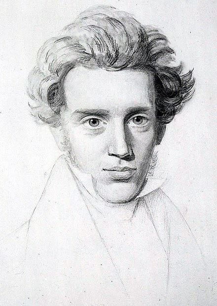

[克尔凯郭尔未完成画像，其兄尼尔斯·克里斯蒂安·克尔凯郭尔作，约1840年 (Wikipedia)]

三言两语介绍一下克尔凯郭尔。他是一个十九世纪（1813-1855）的丹麦哲学家（难得接触英法德之外的欧洲哲学传统），有一个有趣的称呼是“存在主义之父”，而受他影响的思想家其实既有萨特、海德格尔之流，也包括卡夫卡、易卜生等大作家。

克尔凯郭尔一个很独特的点，是他把讨论的议题置于明确的个体上，鼓励我们去理解和参与“没有既定指引的痛苦抉择”。我们不是坐在扶手椅上思考形而上学的英伦绅士（sorry, Mr. Holmes），而必须作为一个有限的个体置身事内的面对哲学问题。比如，这里说的信仰问题。

《恐惧与战栗》里，亚伯拉罕和以撒的故事 (Abraham & Issac) 被作者从圣经中单独挑拣出来，成了直接对抗“庸俗的”宗教观，和被廉价售卖的“信仰”的关键。

这个故事借用《哲学小史》概括如下：
> “亚伯拉罕（Abraham）接到一条来自上帝的旨意，一道极为恐怖的命令：他必须牺牲唯一的儿子以撒（Isaac），把他献祭给上帝。亚伯拉罕陷入深深的痛苦之中，他爱自己的儿子，但同时也是一名虔诚的信徒，知道必须顺服上帝旨意。
>
> 在《旧约全书·创世纪》（Old Testament）里的这个故事中，亚伯拉罕把儿子带到摩利亚山（Mount Moriah）顶，把他绑在石祭坛上，准备按照上帝的指令用刀杀死他。在最后一刻，上帝派来的天使出手阻止，最后亚伯拉罕牺牲了一只被困在附近灌木丛中的公羊用作献祭。作为对亚伯拉罕忠诚的奖赏，上帝让他的儿子活了下来。”

如果只是做一个尽职尽责的传教士，只是从第三人称视角去叙述亚伯拉罕的经历和言行，而不能感受其极大的苦痛（“恐惧”与“战栗”），不能认识信仰与伦理的冲突悖论，那么就会陷入一种不可能言行一致的境地。

因为从普世的伦理 (即“ethical is universal”) 出发，“亚伯拉罕牺牲自己无辜的儿子，而去听从所谓内心的上帝的旨意，并且带着决然的信心相信上帝的预言一定会成真”这样一个故事——如果我们不是已经知道事后的结果，或是认定亚伯拉罕就是信仰典范而给他带上偶像光环——只从行动上看，发生在任何一个人身上，我们都难以认可和接纳。可以试着用一个更现代的视角提问：我们怎么把亚伯拉罕和一个宗教恐怖分子区分开？

所以作者带着我们深入地去探索（deep dive）亚伯拉罕的经历，用各种假想的思维实验去理解亚伯拉罕面对信仰问题时的矛盾与辩证法（dialectical）。

虽然我不太理解作者论述的无限弃绝（infinite resignation）骑士与信仰骑士的形象，但似乎大致明白这里牵涉的信仰和美学、伦理三者的区分和互动。
希腊、罗马的神话和荷马史诗留下许多悲剧英雄的故事，他们背后主宰的是美学的观念和倾向；而康德-黑格尔一脉，强调公共性和普世性的伦理，对良善有更不依赖偶然因素与戏剧性的判断。但信仰的问题不能被美学与伦理囊括，亚伯拉罕所做的事，需要孤独的、沉默的完成，不能传达给听者理解，也不可能得到大家的认可与共情，而他还需要真正对那常理无法理解的事情（书中用的词是荒谬-absurd）饱含希望（hope），需要存留心中的激情（passion）；这好像是另一条更少人行、更莫测的荒僻小路，可能也正因此吸引和激发了大量的解读、阐释与无休止的讨论。

可是，信仰到底意味着什么？以直接的方式和绝对者产生联系，将个体置于普遍性之上，到底能成为一条真正自洽的理念吗？感觉只是读了一遍这本一两百页的书（再加上 John Lippitt 写的 Routledge Guide），我产生的疑问多过得到的解答。

延伸阅读
1. [Kierkegaard](https://plato.stanford.edu/entries/kierkegaard/) 在 Standford 哲学百科中的条目
2. 《哲学小史》第26章：生命中的牺牲。此书最擅用极短的章节刻画一个哲学家的独特之处。读这一章时，我才第一次注意到这个作家

Aside

这次尝试了把原文和导读/阐释类文本交叉来读。由于文本的晦涩和背景知识的缺乏，在理解原文时自己容易遇挫，需要中英文交叉着来读，甚至再结合着英文本的注释和 Routledge Guide 里面对应的章节，才感觉懂了个大概。

读 Routledge 时，有些感慨甚至羡慕 John 能如此细致严谨的钻研这样一个文本，考究不同的阐释，给出自己的评论和见地。能倾注如此心血在这样“不功利”的目的上，是否是一种奢侈？

这让我想到克尔凯郭尔（准确说是沉默的约翰尼斯 Johannes *de silentio*）在前言和尾声里都不无嘲讽的评论当时（1843年）的思想界和商业界其实别无二致：大家都想着清仓甩卖，都用各种策略操纵人们对其价值的认知。这样的观点总是很容易激起我的共鸣。