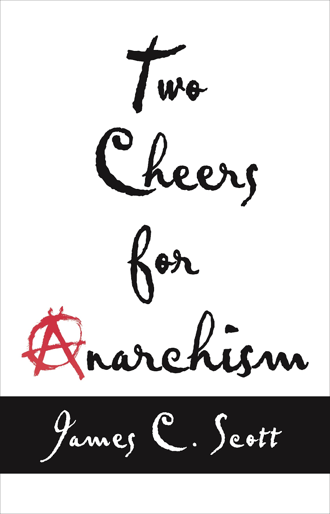

读了历史学家 James Scott 的作品 *Two Cheers For Anarchism: Six Easy Pieces on Autonomy, Dignity and Meaningful Work and Play* ，社会科学文献出版社翻译为《六论自发性》（猜测是因为无政府主义这个词在国内政治考量上太过敏感，于是截取了副标题的一部分进行意译），自己感觉“还没读过瘾”。

没读过瘾是因为作者把文字组织成轻松易读的六个章节（称得上 **easy** pieces），每个章节也只是松散的由更细的片段组合在一起，没有通常学术或非虚构写作的连贯和呼应，也没有大部头作品给人的安心感。
不过据作者在前言所讲，他应该是有意如此去写的，一方面是为了对读者更友好，另一方面也是因为作者自嘲自己没有一套严谨连贯的无政府主义思想，而只是希望提供一系列观察。或者说，透过“无政府主义者的透镜”去观察世界。

### 这本书在讨论什么？
*Two Cheers* 探讨的话题其实很广杂，如果从标题无政府主义进入，那么可以把很多核心的讨论理解成对政府-官方-权威，和背后的经济政治体制的一种审视和批评。如果用无政府主义的透镜去观察这个世界，那些标准化的秩序，量化的考核与评判都令人不满，而人们的自发性、创造性和互利互惠，这些珍贵的特质则没有得到应有的重视。

#### “小资产阶级”
另外还很有趣的，是作者对一个不被认可的词“小资产阶级”（Petite Bourgeoisie）和背后的群体也给予了 two cheers。无政府主义者见到，小资产阶级这一词既被提出这一概念的马克思主义者所蔑视，也会遭到真实掌握资本和权力的“资产阶级”的嘲弄，但他们其实代表着一种很宽泛的社会期待：对自己时间的支配感的向往，对尊严和平等的渴望。这些期待和追求其实不是应当被一笑置之的。而与此同时，小资产者还在发挥着他们自己的社会功能和经济功能，他们能带来人情味、构成熟人网络和团结的社区，而提供了很多标准化的超级市场所看不见的功能。

其实，在作者的叙述里，这些被污名化的小资产者，似乎和我心目中那个还比较模糊的“民主国家的现代公民”，也高度重合了？（只不过洗去了些精英的色彩，而更强调他们虽然有更多自主性，但也可能过得辛苦）从具体意义上说，他们过的生活，不也看起来像是现在很多人孜孜奋斗想要打拼得到的中产生活吗？

#### “为政治辩护”
为政治辩护的说法也很有意思。我们习惯的舆论机器里，常常抨击美国人过度政治化。但作者的思考似乎还是更深一些。

作者为政治辩护，是因为存在真正需要引起讨论的议题和事项，是该诉诸于政治和政治参与的，而比政治的混乱和低效更糟糕的，是有些人相信绝大多数（如果不是所有的）政治问题，可以用看似中立的、技术性的标准指标去量化、去比较，然后用一套同样中立而无主观因素的流程去权衡和做判断。

实际上，很多量化指标，都在悄无声息的地方简化、近似，都在用一个并没有明面写出的价值模型，代替本应该进行的公共讨论。
比如 SAT 等标准化测试用一些易于衡量的数理分析和推理能力，代替对“谁适合上大学”这个问题的回答；而理科和工科通用的 SCI，用单纯的论文引用，极为显著地简化一个学者在学术上的探索和贡献... 
另一方面，由于 [Goodhart's law](https://en.wikipedia.org/wiki/Goodhart%27s_law) ，这些对量化的痴迷还会诱导一些以指标本身为目的的行为，而让指标设立时所希望促成的行为和效果退居次位。

这里，一些现代主义的乐观和信念，看起来并不一定达到好的效果。（作者对他们的诉求源头概括的很精到：其一，提倡机会平等且反对特权和世袭的民主主义；其二，相信价值可以被科学的测量的现代主义。）表面上 reasonable 的平等和民主，压制了（本该发生的）政治讨论，反而并没有为公共福祉带来好处，却让一些质疑和不满噤若寒蝉。

### 再推荐一次这本书
虽然我开头说，这本书用“碎片”加以组织的方式可能会让人读完不过瘾；但这依然不抹煞我愿意推介这本书给朋友读的心情。书里谈的很多现象与观察，对于一个在当代城市生长起来的人都很容易激起共鸣，也相信会引入更多新鲜的思考视角。

这些轻松自由的例子和嬉笑怒骂的真诚，藏在正文仅 140 页的二十九个碎片里，可读性也一并“拉满”了。

我十分期待能和朋友交流书里面的话题和论点。