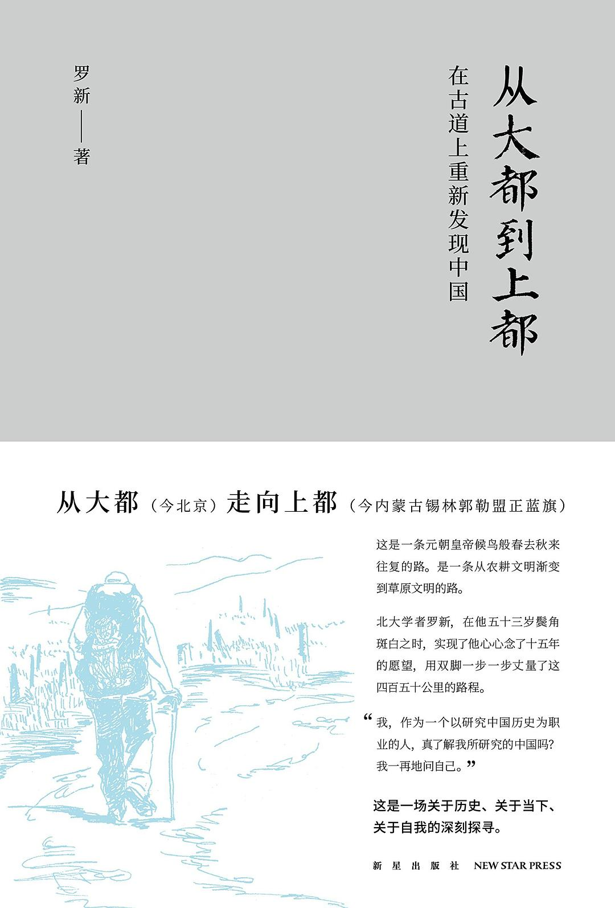

最近读了这本历史学家罗新先生的书，2023 年一月份出版的《从大都到上都：在古道上重新发现中国》（第二版）。

罗先生这本书是他和同伴从北京（元大都）到上都（内蒙古锡林郭勒盟正蓝旗）徒步十五天，大约四百五十公里的旅途记录。他们的经历当然不是悠闲度假，但也比古代筚路蓝缕的跋涉多了些工业社会的便利，时常是早晨起床走半天，中午带点干粮在路上充饥，下午走到当天的目的地，在旅店休整；时不时还会因为旅馆稀少，走完当天的路程打出租车去别处投宿，第二天再打车从原来的点继续出发。甚至头两天罗先生晚上会直接回北京的家休息，第二天再坐地铁或者打车出发。

不过他接近六十岁的年纪，似乎先前也不多有徒步经验，每天背着行李步行二三十公里的走在路上，和疲惫、炎热、水泡作战，又还要每天的用笔记做记录。还是让我生出敬意。

### What (is the book about)
还没有翻到目录，书前就彩图印着元代两都的交通图，书里提到的地点也时常拿来与古代地名和历史掌故相钩连；但又和我的期待不同，书中并没有太具学术性的考究元代的辇路具体如何弯折，如何与现实的山川道路相同或相异，甚至里面提到的历史往事也不限于蒙元的一百年，收入的材料、故事并不受某一个特定主题和历史时期的限制，而只需和步行途中的所见所想有所牵连。

后来知道，罗先生在学院的研究方向是魏晋南北朝史和古代民族史，但看其文字见识，肯定不是具体的某个细分领域所能概括的了。

这样的包罗万象，再配上罗先生流畅生动的文笔，确实让阅读的过程成为一场不断遇到意外收获的旅程。

### How (it relates to me)
这本第一人称的旅行笔记，读起来很容易让人觉得亲近，尤其是他引用其他的书籍、讲述古今故事时，就好像赶上学识甚佳的新朋友兴致正高，愿意向你侃侃分享他的经历。因此极具魅力。但如果真要问，我喜欢其中的什么，我的收获是什么呢？这样必然引向一个高度私人化的回答。

对于我而言，首先是回忆其读这本书时自己纸上旅行的愉快经历，一两个月的很多个夜晚，不论白天发生了什么，都可以在家里的床上，靠着靠枕阅读作者今天走了哪些路，看到哪里的物候风景，又想到了意大利车队 1907 年在八达岭长城参加越野比赛的感叹，或者是和当地的住民有怎样的接触和交流，本身就如同一段在路上真实走过的旅程一样难忘。

其次可能是对华北-内蒙长城内外积累了具体的见闻，比如过了燕山-居庸关视野和气象就和北京迥然不同，而人事方面，仅仅离开北京几十公里，都市就全然抛在脑后了，旧日的县城、村庄、林场、筹划中的度假山庄，一切属于过去和现在时代的定居点和那里的人们，都让我这个见闻绝大部分囿于城市的年轻人贪婪的注视着。

作者说他最大的收获是关于从旅游者向旅行者的蜕变，他希望着能打破学院和“真实”中国的界沟，能以一个背负行囊、汗流浃背的姿态短暂融入经过的地方，而不是一个高高在上的游览者、闯入者。而这种认知和愿景肯定也潜移默化的植入了我的认知里。正如在读而还没读完的杨潇那本《重走》一样，这本书给我种下了一颗行走的种子。

既然我喜欢散步和漫游了，那么这样的徒步和行走呢？肯定不赖吧。

### 附录
书中一些想继续看看的线索：
- 往复 BBS，《频婆果考》张帆
- 更多在旅途中的书籍：
	- *Travels with Charley, in Search of America* by John Steinbeck
	- *The Places in Between* by Rory Stewart ，中译名《寻路阿富汗》
	- 比尔·布莱森《林中行纪》不断步行时会放下景物的感知，而进入行动中的禅
	- 《沙漠驼影》 Robyn Davidson
- 《中国伊朗编》到底写的什么？
- 作者在《上海书评》上发的《走向金莲川》
- Paul Salopek 的走出伊甸园项目